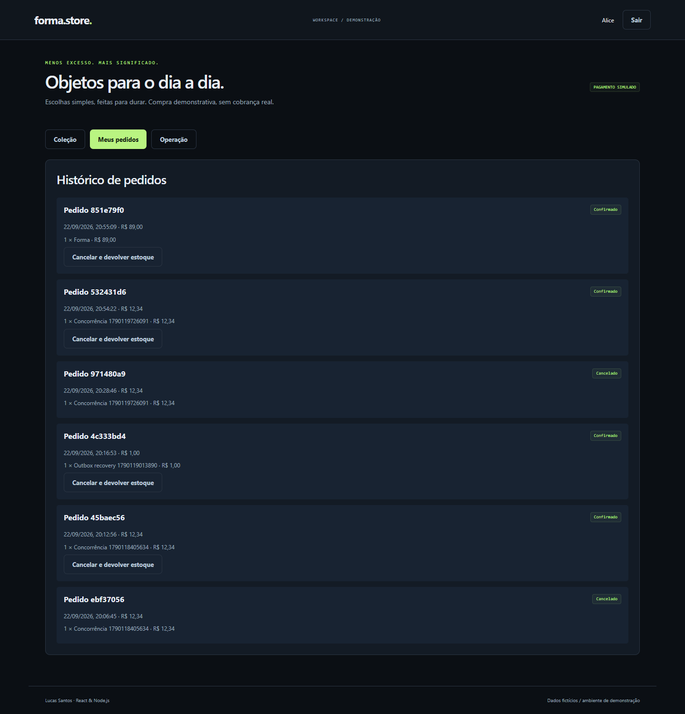
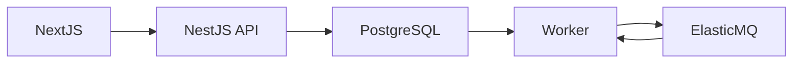

# Forma Store

Loja com Next.js, estoque transacional, checkout idempotente e processamento assíncrono de notificações simuladas.

[](https://github.com/Lucass-Gs/forma-store/actions/workflows/ci.yml)

Projeto de portfólio em React, TypeScript e Node.js/NestJS. Versão funcional de demonstração, com dados fictícios e testes reproduzíveis.



## Executar com Docker

Requisitos: Docker Engine/Desktop em execução e Docker Compose v2. Node.js 24 é necessário apenas para desenvolvimento e testes locais.

```sh
git clone https://github.com/Lucass-Gs/forma-store.git
cd forma-store
docker compose up --build -d --wait
docker compose --profile tools run --rm seed
```

Abra http://localhost:4102. O seed pode ser executado novamente sem apagar dados. Use um perfil de navegador diferente para duas sessões simultâneas.

| Usuário fictício   | Senha local |
| ------------------ | ----------- |
| alice@example.test | Demo1234!   |
| bruno@example.test | Demo1234!   |
| carla@example.test | Demo1234!   |

A configuração padrão funciona sem arquivo .env. Para personalizar, copie .env.example para .env antes da primeira execução. Os valores publicados são exclusivamente credenciais locais de demonstração. As portas são expostas apenas em 127.0.0.1. Alterar a senha do PostgreSQL após inicializar o volume exige também alterar a credencial no banco.

## O que está implementado

- Catálogo consultado pelo servidor Next.js e filtros por pesquisa/categoria, carrinho persistido por usuário.
- Preço e total calculados pela API; locks de estoque em ordem determinística evitam venda acima da disponibilidade.
- Chave de idempotência vinculada ao usuário e ao conteúdo do pedido; cancelamento devolve estoque uma vez.
- Outbox PostgreSQL, worker com SDK AWS SQS, ElasticMQ local, inbox e fila de falhas após cinco recebimentos.

## Roteiro de demonstração

1. Entre como Alice e adicione um produto ao carrinho. Finalize uma compra simulada.
2. Veja o pedido e cancele para devolver o estoque. A área administrativa permite cadastrar produtos.
3. Execute test:resilience para parar o worker, comprar, reiniciar e verificar recuperação e deduplicação.

## Arquitetura



Pedido, estoque e outbox são gravados na mesma transação. Publicar pode acontecer mais de uma vez: a inbox impede que isso duplique a notificação persistida. ElasticMQ exercita a interface SQS localmente; não representa um deploy real em AWS. As notificações são registros no banco, não e-mails enviados.

[Decisões técnicas](docs/DECISIONS.md) · [Operação e diagnóstico](docs/RUNBOOK.md) · [Validação](docs/VALIDATION.md)

## Testes

Com o Compose inicializado e o seed aplicado:

```sh
npm ci
npm run typecheck
npm run build
npm test
docker compose --profile test run --build --rm tests
npx playwright install chromium
npm run test:e2e

# Executar separadamente: interrompe temporariamente um serviço local
npm run test:resilience
```

No Windows, use npm.cmd se a política do PowerShell bloquear npm.ps1. O Playwright usa Microsoft Edge no Windows e Chromium no Linux. Testes de integração criam dados e operações fictícias; execute em ambiente de demonstração. O workflow GitHub Actions também cria o ambiente Docker e executa integração e navegador.

## Estrutura

- apps/api/src: API, autenticação, persistência e domínio.
- apps/web: interface React com Next.js App Router.
- db: migrations SQL e dados de demonstração no seed da API.
- tests: testes unitários, integração e navegador.
- infra: proxy e/ou configurações de infraestrutura.

## Limites e próximos passos

Terraform, deploy AWS, pagamento real, envio de e-mail, métricas de performance/SEO e testes de contrato ainda não foram implementados. O catálogo inicial usa fetch sem cache; não há estratégia avançada de revalidação.

O código demonstra decisões técnicas; senioridade também depende de explicar os trade-offs, manter sistemas e colaborar com uma equipe.

## Autor

Lucas Santos · [LinkedIn](https://www.linkedin.com/in/lucass-gs/) · [GitHub](https://github.com/Lucass-Gs)
